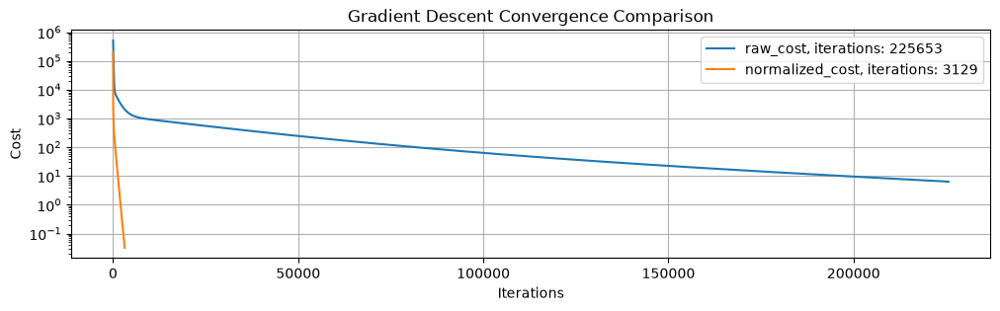
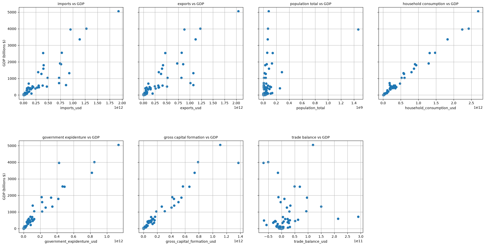
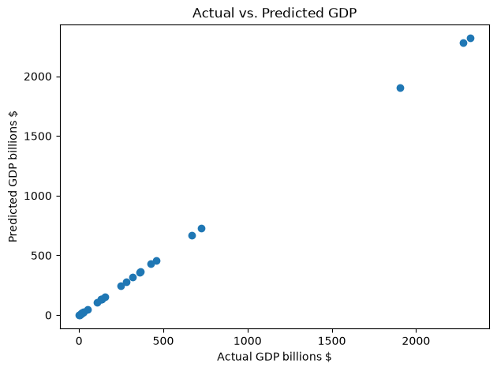

# Multiple Linear Regression From Scratch

## Overview 

This project implements Multiple Linear Regression from scratch in Python to predict the Gross Domestic Product (GDP) of a country. The aim of this project is to demonstrate my understanding of the mathematics behind linear regression by implementing the algorithm without relying on machine learning libraries such as Scikit-learn.

The model is trained using macroeconomic data from the World Development Indicators (WDI) dataset published by the World Bank. Every step of the machine learning pipeline including data preprocessing, feature engineering, feature normalization, gradient descent optimization, model evaluation, and visualization was implemented manually to gain a deeper understanding of how multiple linear regression works.

## Objectives 
The goal of this project is to:
- Build a Multiple Linear Regression model from scratch
- Understand how Gradient Descent optimizes model parameters
- Learn how Z-score normalization affects model performance
- Apply feature engineering to improve prediction accuracy
- Evaluate the model using common regression metrics
- Visualize the learning process and prediction results
- Predict the GDP of countries using user-provided macroeconomic data


## Dataset
The project uses data from the World Development Indicators (WDI) dataset published by the World Bank.

The original dataset was cleaned before training by:
- Removing regional aggregates and economic unions (such as World and European Union)
- Keeping only individual sovereign countries
- Selecting relevant macroeconomic indicators for GDP prediction
- Removing countries with missing data

Dataset source: [World Development Indicators (World Bank)](https://databank.worldbank.org/source/world-development-indicators)

## Features Used 
The following features were used to predict the Gross Domestic Product (GDP) of each country:
- Imports of Goods and Services (Current US$)
- Exports of Goods and Services (Current US$)
- Population
- Gross Fixed Capital Formation (Current US$)
- General Government Final Consumption Expenditure (Current US$)
- Household and NPISH Final Consumption Expenditure (Current US$)

## Feature Engineering
To investigate whether additional information could improve the model's predictive performance, an additional feature was engineered.

**Trade Balance**

Trade Balance = Exports − Imports

This feature represents the difference between a country's exports and imports. It was created to investigate whether incorporating a country's trade surplus or deficit would improve the model's ability to predict GDP.


## Project Structure
The code was organised into separate modules to make it clearer and easier to understand.
```text
multiple-linear-regression-from-scratch/
│
├── data/
│   └── world_development_index_2025_data.csv
│
├── images/
│   ├── actual_scatter_plots.png
│   ├── cost_comparison.png
│   └── actual_vs_predicted.png
│
├── src/
│   ├── preprocessing.py
│   ├── model.py
│   ├── metrics.py
│   ├── visualization.py
│   └── main.py
│
├── README.md
├── requirements.txt
└── .gitignore
```
**preprocessing.py**: 
- Loads and cleans the dataset 
- Performs feature engineering
- Splits the data into training and testing sets 
- Applies Z-score normalization.

**model.py**: 
- Implements the Multiple Linear Regression algorithm, including the prediction function, cost function, gradient computation, and Gradient Descent optimization

**metrics.py**: 
- Contains the regression evaluation metrics, including MSE, RMSE, MAE, and R²

**visualization.py**: 
- Generates plots for feature analysis, cost convergence, and model predictions

**main.py**: 
- Executes the complete machine learning pipeline, from preprocessing and training to evaluation, visualization, and interactive GDP prediction


## How to Run

Follow the steps below to clone the repository, install the required libraries, and run the project.

```bash
git clone https://github.com/Harith-2007/multiple-linear-regression-from-scratch.git
cd multiple-linear-regression-from-scratch
pip install -r requirements.txt
cd src
python main.py
```

If `requirements.txt` does not work for your environment, install the required libraries manually:

```bash
pip install numpy pandas matplotlib
```

The program will:

- Load and preprocess the World Development Indicators dataset
- Apply feature engineering by creating the Trade Balance feature
- Randomly split the dataset into **80% training** and **20% testing** sets
- Apply Z-score normalization to the training data and normalize the testing data using the training statistics
- Train Multiple Linear Regression models using both raw and normalized features
- Compare the convergence of Gradient Descent for both models
- Evaluate the trained model using MSE, RMSE, MAE, and R²
- Generate and save the visualizations
- Allow the user to enter new macroeconomic data to predict a country's GDP interactively

## Implemented From Scratch
The main objective of this project is to implement multiple linear regression without relying on machine learning libraries such as Scikit-learn.

The following components were implemented manually:

- Multiple Linear Regression prediction function
- Mean Squared Error cost function
- Gradient calculation for weights and bias
- Gradient Descent optimization
- Z-score normalization
- Train-test splitting
- Feature engineering
- Mean Squared Error
- Root Mean Squared Error
- Mean Absolute Error
- R² score
- Data and prediction visualizations
- Interactive GDP prediction for user provided inputs

NumPy was used for mathematical operations, but no prebuilt machine learning model or evaluation functions were used.

## Technologies
- **Python** – Main programming language
- **NumPy** – Numerical operations and array handling
- **Pandas** – Data loading and preprocessing
- **Matplotlib** – Data visualization
- **Git** – Version control
- **GitHub** – Repository hosting and project documentation


## Results and Analysis

### 1. Feature Normalization

To train the model, the Z-score normalization method was applied to the input features. The chosen input features had varying scales; for example, the population feature was represented in millions, whereas imports, exports, and expenditure features were represented in billions of dollars. If the input features are not normalized, then the larger numbers will dominate the smaller ones during the optimization process.

Z-score normalization transforms each feature according to the following equation:


z = (x - mean) / standard_deviation


where:

- **x** is the original feature value
- **mean** is the average value of the feature
- **standard_deviation** is the standard deviation of the feature

After applying z-score normalization, the features all had a mean of approximately 0 and a standard deviation of 1. This places all the features on a similar scale so that gradient descent can update the feature parameters more evenly and converge faster

The program displays the feature means, standard deviations, and sample values before and after normalization during execution to verify that the preprocessing step has been applied correctly.

**Normalizing the Test Data**

During preprocessing, the training data set was first normalized to find out the mean and standard deviations of the features. The same statistics were then applied to the normalization of the test data set, instead of calculating new statistics based on the test data set.

This can be clearly seen in the preprocessing pipeline, where the mean and standard deviations calculated from the training dataset are later used to normalize the testing dataset.

Using the training statistics ensures that both the training and testing datasets are scaled consistently. This will allow the trained model to consistently predict the unseen data. The use of mean and standard deviations calculated from the test data set will cause another scaling transformation of the data set, which will give the model inconsistent input data.


### 2. Gradient Descent Convergence

The Gradient Descent algorithm was implemented from scratch to optimize the Multiple Linear Regression model by minimizing the Mean Squared Error (MSE) cost function. During each iteration, the gradients of the cost function with respect to the model parameters (weights and bias) were computed and used to update the parameters in the direction that minimized the prediction error.

To evaluate the effect of feature normalization, the model was trained twice: once using the raw features and once using the Z-score normalized features.

| Model | Learning Rate | Iterations needed to converge |
|-------|--------------:|------------------------------:|
| Raw Features | 1 × 10⁻²⁶ |                       225,653 |
| Normalized Features | 0.1 |                         3,129 |

Due to the large differences in the magnitude of the raw feature values, an extremely small learning rate was required to prevent the optimization process from diverging. As a result, the model required 225,653 iterations to converge.

After applying Z-score normalization, all features were transformed to approximately the same scale. This allowed a much larger learning rate to be used while maintaining stable optimization, reducing the number of iterations required for convergence to only 3,129.

To determine when the optimization had converged, a convergence criterion was implemented. The algorithm was considered to have converged when the absolute difference between the cost values of two consecutive iterations became smaller than 1 × 10⁻⁴. At this point, further parameter updates resulted in only negligible improvements to the cost function.

The figure below illustrates the effect of feature normalization on the convergence of Gradient Descent.

#### Cost Comparison



**Figure 1.** Cost function versus training iterations for models trained using raw and normalized features. The model trained on normalized features converges much more rapidly, while the model trained on raw features requires a significantly smaller learning rate and many more iterations to reach convergence.

Overall, this comparison demonstrates the importance of feature normalization when training machine learning models using Gradient Descent. By transforming all features to a similar scale, normalization significantly improved the stability and efficiency of the optimization process. As a result, the normalized model converged using a learning rate 10²⁵ times larger while requiring approximately 70 times fewer iterations than the model trained on the raw features, substantially reducing the overall training time.


### 3. Feature Relationships

In order to gain insight into the relationship between the selected macroeconomic indicators and Gross Domestic Product (GDP), scatter plots were generated using the training data set. These visualizations provide an initial assessment of how each feature relates to GDP and help determine whether the selected variables are suitable predictors.

#### Scatter Plot Analysis



**Figure 2.** Scatter plots illustrating the relationship between each selected feature and GDP.

Several of the chosen features exhibit a strong positive relationship with GDP. For instance, Household and NPISH Final Consumption Expenditure, General Government Final Consumption Expenditure and Gross Fixed Capital Formation show a strong upward trend, which means that countries with higher levels of consumption and investment generally tend to have larger economies.

In addition, both Imports and Exports show a positive trend with GDP. The countries with higher amounts of foreign trade operations show higher GDP values, while some deviations can be observed among the countries with similar foreign trade volumes.

Population feature also shows a positive relationship with GDP; however, it can be noticed that it is more spread out than others. Thus, we can say that the population alone is a weaker predictor of GDP because the countries with the same population can have significantly different GDPs depending on their economic activity.

Although Trade Balance is an engineered feature, there is no linear relationship between Trade Balance and GDP observed on the scatter plot for different countries. There might be countries with equal Trade Balance and significantly different GDPs, which means that Trade Balance alone is a relatively weak predictor of GDP. But, nevertheless, when taken into account alongside other macroeconomic attributes, it may be helpful in some way.

Overall, these visualizations indicate that the selected features include valuable information about GDP and its prediction, with the expenditure and investment features being the closest to GDP. These findings make Multiple Linear Regression suitable for modelling GDP based on selected macroeconomic indicators.

### 4. Prediction Results

After training the Multiple Linear Regression model, its predictive performance was evaluated using the testing dataset by comparing the predicted GDP values with the corresponding actual GDP values. This comparison provides an indication of how well the model generalizes to unseen data.

#### Actual vs Predicted GDP



**Figure 3.** Comparison of the actual GDP values and the GDP values predicted by the Multiple Linear Regression model on the testing dataset.

The figure shows a strong agreement between the predicted and actual GDP values. For countries with both low and high GDP values, the predictions closely follow the observed values, indicating that the model successfully learned the relationship between the selected macroeconomic indicators and GDP.

Only small deviations between the predicted and actual values can be observed. These differences are expected, as GDP is influenced by many economic, political, and social factors that are not included in the selected features. Despite these minor prediction errors, the model consistently produces realistic GDP estimates across a wide range of economies.

Overall, the prediction results demonstrate that the model generalizes well to unseen data and is capable of accurately estimating GDP using the selected macroeconomic indicators. The close agreement between the predicted and actual values indicates that the model captures the underlying relationships within the dataset effectively.

### 5. Model Evaluation

After training the Multiple Linear Regression model on the normalized training dataset, its performance was evaluated using the unseen testing dataset. Four standard regression metrics were implemented from scratch to measure the accuracy of the model's predictions.

| Evaluation Metric | Value | Interpretation |
|-------------------|------:|----------------|
| **Mean Squared Error (MSE)** | **0.1914** | The average squared prediction error is very low, indicating highly accurate predictions. |
| **Root Mean Squared Error (RMSE)** | **0.4375 Billion USD** | On average, the predicted GDP differs from the actual GDP by approximately **0.44 Billion USD**. |
| **Mean Absolute Error (MAE)** | **0.2394 Billion USD** | The average absolute prediction error is only **0.24 Billion USD**, demonstrating strong predictive accuracy. |
| **Coefficient of Determination (R²)** | **0.9999996** | The model explains approximately **99.99996%** of the variation in GDP, indicating an excellent fit to the testing data. |

The low error values indicate that the predicted GDP values closely match the actual values for the countries in the testing dataset. The near-perfect R² score further demonstrates that the model successfully captures the relationship between GDP and the selected macroeconomic indicators.

These results are expected because the model uses features that are strongly related to GDP, including imports, exports, household consumption, government expenditure, gross fixed capital formation, population, and the engineered trade balance feature. Together, these variables provide a comprehensive representation of a country's economic activity, allowing the model to produce highly accurate predictions.

The near perfect performance is partly explained by the selected features, several of which are components of GDP under the expenditure approach. Therefore, the model primarily demonstrates the ability of multiple linear regression to learn an underlying accounting relationship rather than forecast GDP from fully independent indicators.

The evaluation results, together with the prediction scatter plot, demonstrate that the implemented Multiple Linear Regression model generalizes well to unseen data and provides reliable GDP predictions while being implemented entirely from scratch without the use of machine learning libraries such as Scikit-learn.

## Interactive Prediction 

The project includes an interactive prediction feature that allows users to estimate the Gross Domestic Product (GDP) of a country by entering its macroeconomic indicators. After the model has been trained, the user is prompted to provide the required feature values:

- Imports of Goods and Services (Current US$)
- Exports of Goods and Services (Current US$)
- Population
- Gross Fixed Capital Formation (Current US$)
- General Government Final Consumption Expenditure (Current US$)
- Household and NPISH Final Consumption Expenditure (Current US$)

The program automatically computes the engineered Trade Balance feature, normalizes the input using the training dataset's mean and standard deviation, and passes the normalized values to the trained Multiple Linear Regression model to generate a GDP prediction.

This functionality demonstrates how the trained model can be used on new, unseen data and provides a practical example of applying the implemented regression algorithm outside the original dataset. It also highlights the complete machine learning workflow, from data preprocessing and model training to making predictions on user-provided inputs.


## Reflection 
Developing this project provided a deeper understanding of how Multiple Linear Regression works beyond simply using existing machine learning libraries. Implementing every stage of the algorithm from scratch—including data preprocessing, feature engineering, normalization, Gradient Descent, prediction, evaluation metrics, and visualization—helped reinforce the mathematical concepts behind linear regression and the importance of each step in the machine learning workflow.

One of the most valuable lessons learned was the impact of feature normalization on Gradient Descent. Training the model on raw features required an extremely small learning rate and significantly more iterations to converge, whereas the normalized features allowed the model to converge much faster with a much larger learning rate. This demonstrated how proper data preprocessing can greatly improve both training efficiency and numerical stability.

Overall, this project strengthened my understanding of linear regression, optimization, data preprocessing, model evaluation, and Python programming. It also provided valuable experience in organizing a complete machine learning project, documenting the implementation, and using Git and GitHub to present the work in a professional manner. These skills form a strong foundation for more advanced machine learning and deep learning projects in the future.

## Author
Al-Harith Al Harrasi

Artificial Intelligence Student
German University of Technology in Oman (GUtech)

GitHub: [Harith-2007](https://github.com/Harith-2007)


## Project Status

✅ Completed — This project is fully implemented and documented.